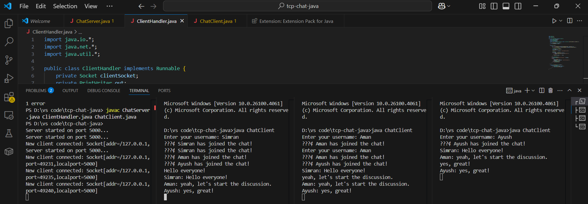
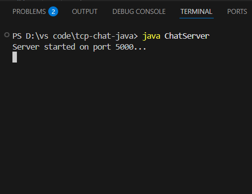
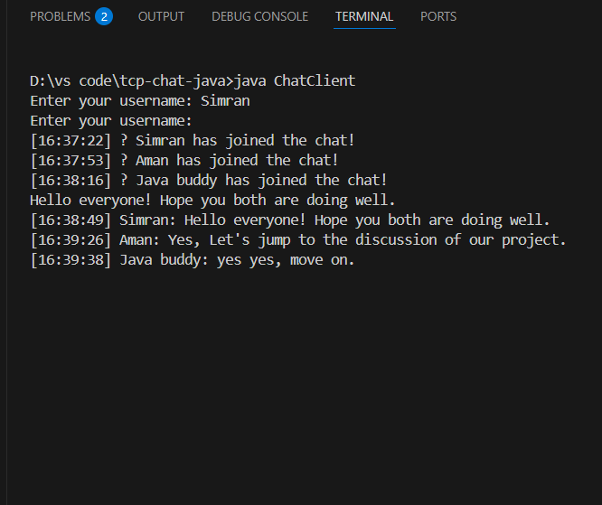
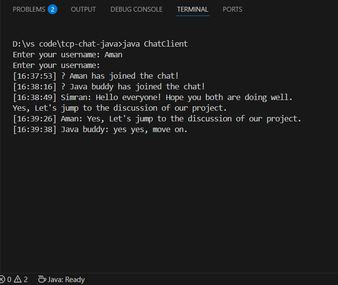
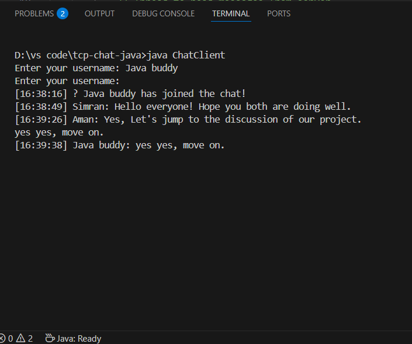

# ⚡ Java TCP Chat CLI

A lightweight command-line chat application built in Java using TCP sockets. This project demonstrates real-time communication between a server and multiple clients using threads.

## 📜 Features

- 🔌 **Multi-client support:** Multiple users can connect and chat simultaneously.
- 💬 **Live messaging:** Instant message broadcasting across all connected users.
- 🔐 **Unique usernames:** Each client must pick a unique username at the start.
- 🧵 **Multithreaded server:** Server handles each client in a separate thread for smooth concurrent communication.
- 💾 **Logging:** Chat messages are saved in a `chatlog.txt` file on the server side.
- 🚫 **Input validation:** Rejects empty or duplicate usernames.
- 🧼 **Graceful disconnection:** Automatically notifies others when a client leaves.
- 🎛️ **Clean CLI interface:** Simple terminal UI for chat.

---

## 🏗️ Project Structure

```

tcp-chat-java/
│
├── ChatServer.java         # Starts the server and listens for client connections
├── ChatClient.java         # Client-side code to connect to server and send/receive messages
├── ClientHandler.java      # Server-side thread for handling each client
├── chatlog.txt             # Log file storing chat messages (created at runtime)
└── README.md               # Project documentation (this file)

````

---

## 🚀 Getting Started

### 1. Clone the repository
```bash
git clone https://github.com/simran-n17/java-tcp-chat-cli.git
cd java-tcp-chat-cli
````

### 2. Compile the code

```bash
javac ChatServer.java ChatClient.java ClientHandler.java
```

### 3. Run the server

```bash
java ChatServer
```

By default, it runs on `localhost:12345`. You can change the port in `ChatServer.java`.

### 4. Run one or more clients (in new terminals)

```bash
java ChatClient
```

Each client will be prompted to enter a **unique username** before joining the chat.

---

## 📌 Sample Usage

---

## 📄 Log File

* All chat messages are saved in `chatlog.txt` on the server side.
* Example log entry:

```




```

---

## 🛠️ Technologies Used

* Java SE 11+
* Java Sockets (`java.net`)
* Multithreading (`java.lang.Thread`)
* File I/O for logging

---


## 🌟 Future Improvements

* GUI-based client using JavaFX (optional)
* Encryption for secure messaging
* Private messaging support
* Emoji and markdown support
* Server admin commands (e.g. kick/ban)

---
